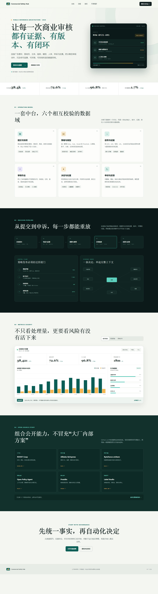
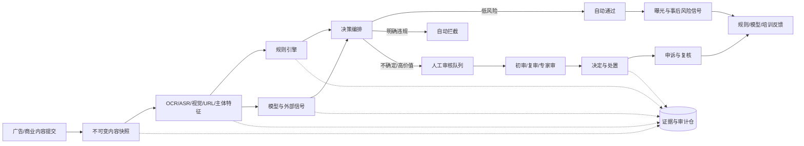

# 商业化安全审核数据中台

面向广告、营销活动、付费内容、商品推广和商业账号的安全审核数据化项目。它把素材、落地页、主体、商品、账户、规则、模型、人工审核、申诉和处罚连接成可追溯的数据链路，用统一指标回答“审了什么、为什么这样判、哪里容易错、风险是否泄漏、规则上线是否有效”。

> 本仓库是公开的产品与数据架构样板，不包含任何公司的内部规则、审核数据、模型权重、接口地址或生产源码。项目基于公开 GitHub 仓库总结通用工程经验，不代表腾讯、阿里、字节、微软、AWS 或其他公司对本方案的认可。



## 为什么需要数据中台

商业化安全审核不是单个分类模型。一次审核可能同时涉及广告主资质、文案、图片、视频、音频、落地页、商品、行业准入、定向人群、历史违规和地域法规。若规则、模型和人工结果分别存放，就很难回答：

- 同一素材为什么在不同时间、地域或产品位得到不同结论？
- 自动审核的召回、误杀、漏放和人工成本分别是多少？
- 某次规则或模型发布影响了哪些流量、收入和风险？
- 申诉翻案来自规则缺陷、模型漂移、证据缺失还是审核员分歧？
- 高风险内容已经曝光多少、持续多久、通过哪个版本的策略？

本项目把“策略执行系统”和“审核数据系统”分开：在线系统负责低延迟判定，数据中台负责版本、证据、评测、分析、追溯和改进闭环。

## 目标架构



## 六个核心数据域

| 数据域 | 关键对象 | 设计重点 |
| --- | --- | --- |
| 提交与快照 | 广告主、账户、Campaign、Creative、落地页、商品、资质 | 内容哈希、版本、地域、投放位和提交时间不可变 |
| 策略与模型 | Policy、Rule、RuleSet、Model、Threshold、Feature | 草稿、影子、灰度、生效、回滚和版本血缘 |
| 信号与证据 | OCR/ASR、图像标签、URL、主体风险、历史处罚、外部名单 | 原始值最小化，保存来源、版本、置信度和快照引用 |
| 审核作业 | Case、Task、Queue、Assignment、Reviewer、SLA | 优先级、技能组、盲审、复审、冲突和超时升级 |
| 决定与执行 | Decision、Violation、Action、Reason、Enforcement | 决定与处置分离，完整记录理由和可解释证据 |
| 申诉与反馈 | Appeal、Recheck、Overturn、Feedback、Dataset | 翻案原因、标签质量、规则缺陷、模型漂移和训练集准入 |

## 关键原则

1. **快照先于判断**：保存审核时看到的内容版本、规则、模型、阈值和外部信号版本。
2. **规则即代码**：规则可校验、可测试、可 Diff、可灰度、可回滚，不允许直接在线改表达式。
3. **模型只是信号**：模型分数不能代替政策结论；路由层结合业务、法规、置信度和历史信息。
4. **人机协同**：低风险自动通过、明确风险自动拦截、不确定和高影响案件进入人工队列。
5. **证据可追溯**：每个决定关联命中规则、特征、模型、内容快照、审核人和处置结果。
6. **默认保护隐私**：审核界面和分析层按最小需要展示主体、用户和支付数据。
7. **安全与商业双指标**：不能只优化通过率、收入或处理量，也不能只追求拦截量。

## 指标框架

```text
入口规模
  └─ 自动化：自动通过率 / 自动拦截率 / 人审率 / 规则与模型覆盖率
      └─ 效率：吞吐 / 排队时长 / 审核时长 / SLA / 单案成本
          └─ 质量：抽检准确率 / 召回 / 精确率 / 分歧率 / 一致性
              └─ 纠错：申诉率 / 翻案率 / 重审率 / 撤销时长
                  └─ 风险：漏放曝光 / 风险存续时长 / 重复违规 / 严重事件
                      └─ 商业：安全通过 GMV/消耗 / 误杀损失 / 风险调整收益
```

所有指标必须带项目、业务线、地域、行业、政策版本、模型版本、内容类型和审核渠道等切片，同时设置最小样本量，避免用小样本评价审核员或模型。

## 开源项目学习

本项目重点参考以下公开项目的工程模式：

- [ROOST Coop](https://github.com/roostorg/coop)：审核工作台、队列、路由、自动执行规则和分析。
- [Alibaba QLExpress](https://github.com/alibaba/QLExpress)：来自电商业务的规则 DSL、表达式追踪、默认隔离和超时。
- [ByteDance arishem](https://github.com/bytedance/arishem)：轻量、高性能规则执行结构。
- [Open Policy Agent](https://github.com/open-policy-agent/opa) / [Cedar](https://github.com/cedar-policy/cedar)：策略即代码、Schema、默认拒绝和决策日志。
- [Microsoft RulesEngine](https://github.com/microsoft/RulesEngine)：规则与业务代码解耦、工作流化规则定义。
- [Presidio](https://github.com/data-privacy-stack/presidio)：文本、图片和结构化数据中的敏感信息识别与脱敏。
- [Label Studio](https://github.com/HumanSignal/label-studio) / [Argilla](https://github.com/argilla-io/argilla)：多模态人工标注、复核和反馈数据集。
- [Microsoft Responsible AI Toolbox](https://github.com/microsoft/responsible-ai-toolbox)：错误、群体、公平性和模型解释分析。
- [Unleash](https://github.com/Unleash/unleash)：灰度发布、目标人群、Kill Switch 和回滚思路。
- [AWS 广告架构样板](https://github.com/aws-samples/sample-well-architected-custom-lens)：广告欺诈、内容校验和合规检查视角。

完整调研、适用边界和许可证提示见[开源项目调研](docs/开源项目调研.md)。仓库没有复制上述项目源码。

## 仓库结构

```text
commercial-safety-review-data-hub/
├─ index.html / styles.css / app.js       # 静态产品与指标看板
├─ catalog/                               # 实体、政策分类、信号与指标目录
├─ contracts/                             # 任务、决定、证据与申诉 JSON Schema
├─ workflows/                             # 审核状态机与路由规则样板
├─ evals/                                 # 规则、模型、权限、证据和流程评测 Case
├─ sources/                               # GitHub 调研来源与采用决策
├─ docs/
│  ├─ 开源项目调研.md
│  ├─ 商业化安全审核中台设计.md
│  ├─ 指标体系与运营看板.md
│  └─ 数据治理与合规边界.md
└─ .github/workflows/validate.yml         # JSON、Schema 和静态资产校验
```

## 本地预览

首页是无依赖静态站点，可直接打开 `index.html`，或运行：

```bash
python -m http.server 4173
```

然后访问 <http://127.0.0.1:4173>。

## 当前完成度

- [x] 产品首页与审核运营看板样板
- [x] 核心实体、政策分类、信号和指标目录
- [x] 审核任务、决定、证据和申诉协议
- [x] 状态机、队列路由与双人复核样板
- [x] 自动化、质量、风险、申诉和商业指标框架
- [x] 开源项目调研及采用/谨慎采用/不采用决策
- [x] 基础评测 Case 和 GitHub Actions 校验
- [ ] 接入真实身份、政策中心、内容快照和审核队列
- [ ] 接入 OCR/ASR/视觉/URL/主体风险信号
- [ ] 落地规则影子、灰度、回滚和效果归因
- [ ] 建立脱敏 Golden Set 与持续评测流水线

## 安全边界

- 示例数据、ID、政策和指标均为虚构样板，不代表真实业务规则。
- 不保存真实广告素材、用户信息、支付信息、内部政策正文或模型密钥。
- 不公开规避审核的方法、阈值细节或可被攻击者反向利用的特征组合。
- 生产接入必须完成权限、隐私、地域、保留期限、未成年人和行业法规评审。
- 自动化不得替代法律意见，也不得在缺少人工复核时执行高影响封禁或资金动作。
